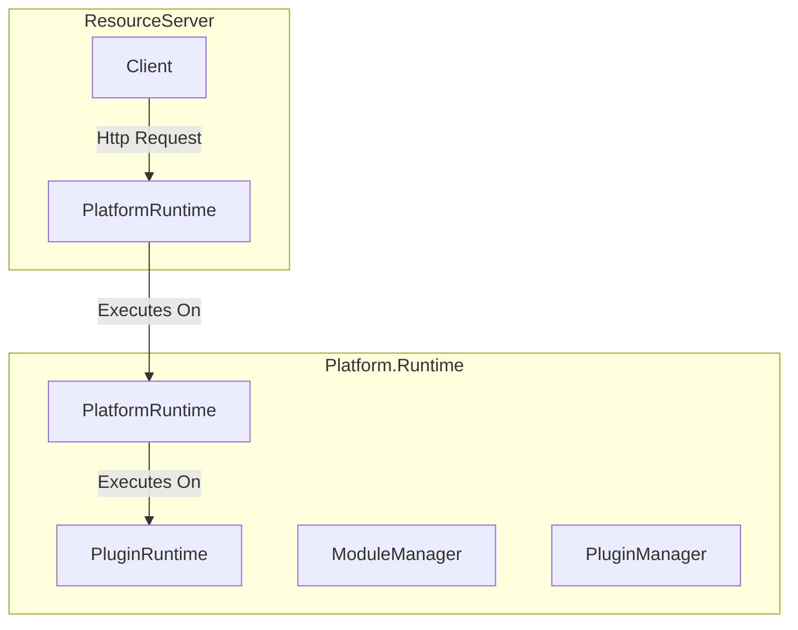
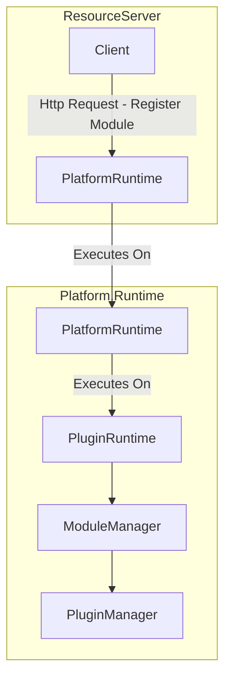

## Standard Request

```mermaid
flowchart TD
    subgraph Platform.Runtime
        R1[PlatformRuntime]
        R2[PluginRuntime]
        R3[ModuleManager]
        R4[PluginManager]
    end

    subgraph ResourceServer
        RS_P1[Client]
        RS0[PlatformRuntime]
    end

    %% Flow
    RS_P1 -->|Http Request| RS0
    RS0 -->|Executes On| R1
    R1 -->|Executes On| R2
```

## Management Request

```mermaid
flowchart TD
    subgraph ResourceServer
        RS_P1[Client]
        RS0[PlatformRuntime]
    end

    subgraph Platform.Runtime
        R1[PlatformRuntime]
        R2[PluginRuntime]
        R3[ModuleManager]
        R4[PluginManager]
    end

    %% Flow
    RS_P1 -->|Http Request - Register Module| RS0
    RS0 -->|Executes On| R1
    R1 -->|Executes On| R2
    R2 --> R3
    R3 --> R4
```